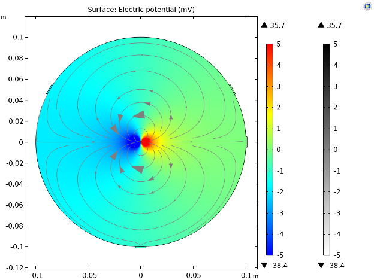
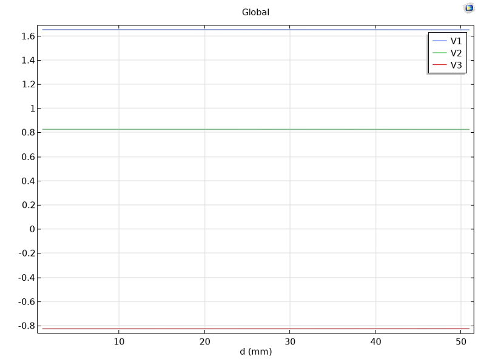
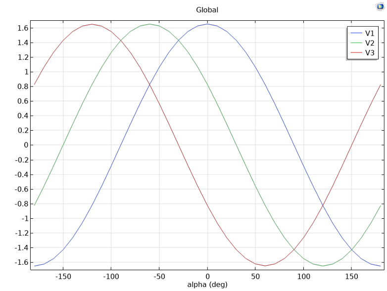
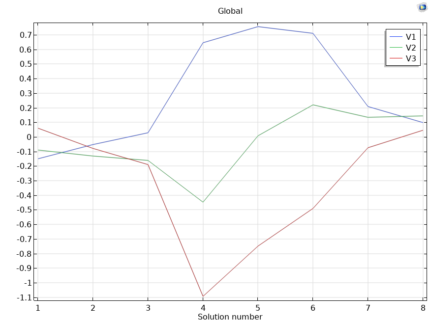

# 🫀 COMSOL Simulation: Dipole Modeling of the ECG (HW #4)

This project explores a COMSOL-based biophysical simulation of the electrocardiogram (ECG) using a simplified torso model. It focuses on the effects of dipole location, orientation, and medium on electric potentials recorded by virtual electrodes representing Einthoven's triangle.

---

## 🧪 Simulation Overview

- A circular torso model with three electrodes: RA (right arm), LA (left arm), LL (left leg)
- A stationary dipole at the torso center simulates the heart's electric field
- Electrode voltages (unipolar and bipolar leads I, II, III) are extracted using surface-averaged voltage measurements
- The simulation also explores:
  - Reference point placement (ground at origin or ±10 cm)
  - Effects of dipole separation and angle
  - Animated potential fields and lead voltages
  - Behavior in conductive environments (e.g., immersion in water)

---

## ⚙️ Simulation Parts

### 🌀 Part 1: Stationary Dipole Source

- Constructed a simplified circular torso (radius = 10 cm)
- Placed 3 surface electrodes at triangle vertices
- Simulated electric field of a central dipole
- Compared electrode voltages with:
  - Ground at origin
  - Ground at (+10, 0)
  - Ground at (–10, 0)

📊 **Results**:
- Electric potential map with streamlines  
- Bipolar lead voltages: VI, VII, VIII  
- Analysis of electrode-ground configurations

📈 **Voltage Table**:
(see [`electrode_data.xlsx`](./assets/electrode_data.xlsx))

---

### 🧲 Part 2: Varying Dipole Separation

- Swept dipole separation `d` from 1 to 51 mm
- Measured VI, VII, VIII across parametric steps

🎞️ `HW4-Movie-1.gif`  
> Animated GIF of potential fields as `d` increases

---

### 🔄 Part 3: Varying Dipole Angle

- Swept dipole angle `a` from –180° to +180°
- Observed voltage response across leads

🎞️ `HW4-Movie-2.gif`  
> Rotation of the dipole visualized in voltage maps

---

### 💓 Part 4: Simulating a Heart QRS Loop

- Simulated 8 different QRS-like heart dipoles (varying `p`, `d`, `a`)
- Plotted QRS signal across time for leads I, II, III

🎞️ `HW4-Movie-3.gif`  
> Animation of QRS sequence across time points

---

### 🌊 Part 5: Immersion in Conductive Medium (Extra Credit)

- Simulated torso surrounded by river water
- Compared QRS signal vs. baseline air environment

> Electrodes show reduced voltage contrast due to greater shunting in conductive surroundings

---

## 📂 Project Files

| File | Description |
|------|-------------|
| `HW4-COMSOL-1.mph` | Model file for Parts 1–4 |
| `HW4-COMSOL-2.mph` | Water immersion model (Part 5) |
| `HW4-Movie-1.gif` | Dipole separation animation |
| `HW4-Movie-2.gif` | Dipole angle animation |
| `HW4-Movie-3.gif` | QRS loop animation |
| `electrode_data.xlsx` | Raw voltage data from COMSOL |

---

## 🧠 Key Learning Points

- The dipole separation and orientation significantly affect lead voltage morphology
- Electrode reference placement alters potential baseline but preserves differential signals
- A highly conductive medium compresses voltage gradients and distorts measured ECG

---

## 🧑‍💻 Author

Manan Bhatt  
Johns Hopkins University — Applied Bioelectrical Engineering  
COMSOL HW #4 — Spring 2025
